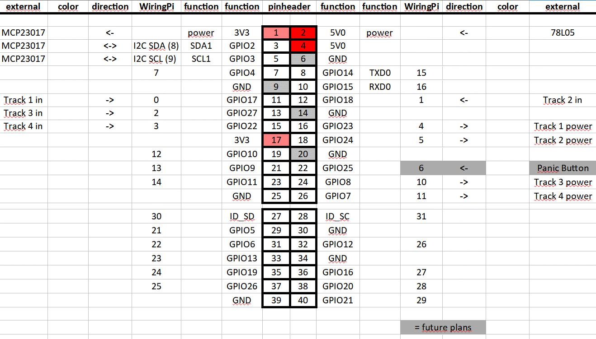

# YAST - Yet Another Slotcar Timer for Raspberry Pi


This repo `yast` is a slotcar timing software. It is designed to run on a Raspberry Pi under Linux.

## Motivation

After driving my analogue slotcars at home for some years with a DOS based timing system
on an old PC, I want to go to present. The old software was very, very good, but my hardware was toooo old.
This project idea was started since I found no slotcar timer working on Raspberry Pi without
any other timing relevant hardware on micro controller board or so.

Goal was to have a timing software for minimum of four tracks with a accuracy of 1/1000 sec.
It should be a codepage 437 based terminal program written in C.
The lap time storage and evaluation is based on an fixed size array.
This is done to get a constant speed and with respect to the (first Pi's) ARM performance.
It uses curses for displaying, so it can be used on the local console and via network terminal with LAN/WLAN.
The input and timing events are realized with interrupts embedded with WiringPi.
But the main loop with result calculation, output and so on is running in a polling solution.
That's no really a fine solution and raises the power consumption of the Pi.
But after a small main loop tuneup this was reduced to less 10% of the calculation power of a 700MHz RPi.
However, for me it works as a first timing solution.

## Features

- Can be used via HDMI output or via Network.
- Big font to have a quick overview on timing and laps.
- Two font sizes are possible (3x3 and 3x5)
- Up to four tracks are supported.
- Track colors can be configured in range of console colors
- Results are displayed for each track:
  - Lap counter from 0 to 9999.
  - Actually lap time from 0.000 to 99.999 seconds.
  - Fastest lap time from 0.000 to 99.999 seconds.
  - Race position for each track.
  - Time behind the leader on same lap number.
  - Over all times fastest lap time for each track.
  - Reaction time for each track.
  - timing of the last three laps
- Total time in race clock.
- Time / lap to go is shown in race mode, Real time clock while training (option)
- Traffic light at the display (flags are also shown)
- Traffic light in hardware over I2C Serial Interface with MCP23017, MC23008 or SN3218
- Checkered flag on race end at the display.
- Minimum lap time / gap between two laps can be programmed in ms to avoid double counting.
- Red flag key, no timing is measured while red flag, track power off
- Timing data can be written to an output file for evaluation, resolution is timing of each single lap on each track.
- Output file as CSV for spreadsheet usage
- Output files will be written side by side to prevent overwriting.
- Race Mode:
  - Free start with power on track before the green light is on.
  - End lap programming with a minimum 1 lap and a maximum of 999 laps.
  - End time programming with minimum of 10 seconds and a maximum of 6 hours
- PANIC / CHAOS / ERROR button on keyboard
- Track power switching supported
- Some sounds are supported on events ( track power on / off, timing valid / non valid, timing off)
- Drivers name can be shown on every track
- Delays for time gap between PANIC-Button / timerace end and timing off can be configured
- Configuration to track, hardware and race type by config file, command line options and compile time options

  
## Usage

### CLI

```markdown

# Usage:

    yast [OPTIONS]

# Command line options are:

   -a   : activate track power switching
   -c   : hardware check loop, endless, sound possible (quit with CTRL-C)
   -D n : set DEBUG level to n, default = 0, max = 2
   -d n : n is delay time in ms between two track events
   -f   : activate false start detection
   -h   : this little help, exit
   -l n : n is number of laps to run in race
   -Nn s: n is number of track, s is drivers name
   -n s : s is filename, filename counter isn't active, file will be overwritten
   -o   : write a logfile of the track timing
   -r   : view real time clock in screen while no race is ongoing
   -s   : activate sound (if compiled in)
   -t n : n is number of seconds to run in race
   -u n : n is number of used tracks
   -v   : printout Copyright and Version information, exit
   -vv  : printout Version, compile and config information, exit  (Place at command line where you will brake)
  	
# Function Keys:
   F01 - reset track 1 parameter
   F02 - reset track 2 parameter
   F03 - reset track 3 parameter
   F04 - reset track 4 parameter
   F09 - red flag
   F10 - yellow flag
   F11 - green flag (free driving, training)
   F12 - prepare a race with specified number of rounds / time
   END - key will exit the program
   E - end of race
   g - goon after PANIC
   p - PANIC BUTTON
   W - write next timing file to disk
   ALT 1 - simulate track 1 pulse
   ALT 2 - simulate track 2 pulse
   ALT 3 - simulate track 3 pulse
   ALT 4 - simulate track 4 pulse
   Shift F01 - reset track 1 fastest lap
   Shift F02 - reset track 2 fastest lap
   Shift F03 - reset track 3 fastest lap
   Shift F04 - reset track 4 fastest lap
     
# Usage of the DEBUG LEVEL Option -D n with n as:
   0: is no debug, default
   1: printout all messages and errors from main display also to stderr
   2: add some more verbose output to stderr
  
```  

## Hardware

I use a Raspberry Pi Type 1 Mod. B, a 3 Mod B and a 4 Mod. B. A 1 Mod B+ is also tested. But also Type A, A+,
B2 and all others up to Mod.4 are usable (I think so).\
$${\color{red}Raspberry Pi 5 cannot be used at the moment. WiringPi does not support it yet. }$$ 
To prevent confusion on the GPIO pin enumeration I try to disentangle these informations
about RaspberryPi hardware and WiringPi software.
Inside the yast I use the wiringPi numbering.
At the 26 Pin GPIO port of the Raspberry Pi you will find the
IO Pins on a Model B, Rev. 2, in the following way:

| Schematic Name | Pinheader Number | WiringPi Number | Track Number |
|:---:|:---:|:---:|:---:|
| GPIO 17 | PIN 11 | 0 | 1 |
| GPIO 18 |PIN 12 | 1 | 2 |
| GPIO 27 | PIN 13 | 2 | 3 |
| GPIO 22 | PIN 15 | 3 | 4 |
| GND  | PIN 6 | - | - |


The first 26 Pins of the newer 40 pin header seems to be the same for this.
 
For further information see the wiringPi project.  
I use these WiringPi Number 0,1,2,3 for Track 1,2,3,4.
Also there is a HEF 4528 monostable multivibrator for a defined pulse shaping used from my side.
But there is no Input Track Pulse Shaping hardware urgently required to run yast.

The track power switching is done by switching a GPIO pin.
The pin can be chosen by config file.
There is no track power switching hardware urgently required to run yast.


For Traffic Lights output an I2C MCP23017, MCP23008 or I2C SN3218  are supported.
The I2C interface of the IO expander is connected to I2C Nr. 1 of my Raspberry Pi B (Rev. 2).

A standard IO Extender based on MCP23017 or MCP230008 with one two IC's can be used. 
The MCP23017 / MCP230008 or the SN3218 can be configured in Makefile.
There is no Traffic Light hardware urgently required to run yast.


| Schematic Name | Pinheader Number |
|:---:|:---:|
| I2C SDA | PIN 3 |
| I2C SDL | PIN 5 |
| GND | PIN 6 |
	
For more details on pulse shaping, track power switching and more hardware take a look at [YAST - Hardware Collection](hardware.md).

Last in this chapter a summary of the possible hardware connections to the Pi with YAST.


 
## Installation

Installation seems to be more complex with these fast development cycles of debian/raspbian versions.
So i spend a separate file for this.
[YAST - Installation](install.md)

## Sound

Sound is not really required for pure racing, but it can be useful to increase attention.
To use the sound output you have to compile it in.
First the alsa development files are required. Download them by:

<cite> sudo apt-get install gcc libasound2 libasound2-dev</cite><br>
and set in the <cite>Makefile</cite> <br>
<cite> ALSA_SOUND_LIB := -lasound<br>ALSA_SOUND := -DALSA_SOUND</cite><br>
After compile the -s option should work.
 

## Files

### Dynamic generated files

<cite>$RESULTPATH/timing_XXXX.txt</cite><br>
This is the timing result file.
For storing timing data of the last counted events beginning from the first Lap including
reaction time. This file will be written after end of race or pressing the "W"rite key.
The file number is generated automatically by searching the next free file number between 0000 and 2499.
And if a file is written, the next free number will be searched.
This file number is shown on main window.
There are two storage formats. One is the old "Classic" one and also an CSV format is possible.
The file name can be defined via config file and will be extended with "_XXXX.txt"
where XXXX represents the storage file number. The file path can be a separate directory,
also to be defined in the config file. It must be given with a slash (/) at the end.

CLASSIC:  
The storage format uses a ; for a comment line.
The data is stored with track number starting from 1, round number starting from 1
and time in seconds. One result each line.

CSV:  
The storage format uses a # for a comment line.
The data is stored with leading round number starting from 1 followed by time
in seconds for each line. A not finished count gets a zero entry.

<cite>$YASTPATH/yastdata.txt</cite><br>
This is the permanent data file.
The File stores the data of the overall fastest Laps for each track.
The file will be written after leaving yast and read back while startup.

## Configuration

There are three kinds of configuration possible. First there
is a configuration file. It is placed at <cite> /etc </cite> or local in the same
directory like yast itself (<cite>  $YASTPATH </cite>). It's called yast.conf.
Here you can configure track related things.
See this example:

```markdown
 # configuration file for yast
 # command line parameters are on higher priority than config file
 
 # TrackXColor defines the font color for track X
 # track 1 to 4 is possible
 # possible values are :
 #  RED
 #  GREEN
 #  BLUE
 #  YELLOW
 #  MAGENTA
 #  CYAN
 #  WHITE
 #  BLACK (makes no sense on black background, later on)
 
 Track1Color: RED
 Track2Color: GREEN
 Track3Color: BLUE
 Track4Color: YELLOW
 
 # TrackXInput defines the WiringPi input number of the track X
 # track 1 to 4 is possible
 # possible values are :
 #  0,1,2,3,4,5,6,10
 
 Track1Input: 0
 Track2Input: 1
 Track3Input: 2
 Track4Input: 3
 
 # TrackXInputEvent defines the WiringPi input event type for the track X
 # track 1 to 4 is possible
 # possible values are :
 #  INT_EDGE_RISING
 #  INT_EDGE_FALLING
 
 Track1InputEvent: INT_EDGE_RISING
 Track2InputEvent: INT_EDGE_RISING
 Track3InputEvent: INT_EDGE_RISING
 Track4InputEvent: INT_EDGE_RISING
 
 # TrackXInputPUD defines the WiringPi input pull up/down type for the track X
 # track 1 to 4 is possible
 # possible values are :
 # PUD_OFF
 # PUD_UP
 # PUD_DOWN
 
 Track1InputPUD: PUD_OFF
 Track2InputPUD: PUD_OFF
 Track3InputPUD: PUD_DOWN
 Track4InputPUD: PUD_DOWN
 
 # Number of used tracks can be also given here
 NumberOfTracks: 3
 
 # The minimum lap time between two rounds
 MinimumLapTime: 2500
 
 # TrackCurrentOutput defines a WiringPi GPIO for switching the Track
 # Power while panic/error and end of race
 # -1 means not used 
 # also only one for all is possible by usage of the first
 TrackPowerOutput1: 4
 TrackPowerOutput1: 5
 TrackPowerOutput1: -1
 TrackPowerOutput1: -1

 # TrackCurrentActive defines track power switching enabled = 1, disabled =0.
 # default is 0
 TrackPowerActive: 1
 
 # ResultFilePath defines the data storage file path and must end with "/"
 ResultFilePath: result/
 
 # ResultFileName defines the data storage file name and will be extended with "_XXXX.txt"
 # XXXX represents the storage file number
 ResultFileName: timing
 
 # ResultFileFormat defines the data storage format of the output 
 # 0 is default and the old style format
 # 1 is an ; - separated format for an easier import to spreadsheet software
 RESULTFILEFORMAT: 1

 # There is a random value of one to three seconds after the last red light to go off
 # With this NO_RANDOM_LIGHT_STARTUP it will be set to one second fix
 # NO_RANDOM_LIGHT_STARTUP
 
 # delay between panic button and time measurement stop
 # time given in ms
 # default is 800 ms
 # this will be set to 0 ms if no track current switching is enabled
 PANICDELAYTIME: 1000
 
 # delay time between end of time race track current and time measurement stop
 # time given in ms
 # default is 800 ms
 # this will be set to 0 ms if no track current switching is enabled
 TIMERACEENDDELAYTIME: 1000
 
 # do it with sound or not
 # 1 = ON
 # 0 = OFF (default)
 SoundActive: 0

 # show the RealTimeClock at the training display
 # 1 = ON
 # 0 = OFF (default off, because I'm a slot junkie wasting much time on it)
 RTCActive: 0

```

The next is the command line interface.
There are race time, number of laps, number of used tracks in race and so on....  
Command line options are stronger then config file options.

All other configurations must be
done in the file "yast_define.h" in their state of the project.

## Racemodes
There are two race modes implemented:
Race on time and race on lapcount.

Race on time - sequence after start:
- track power on (if enabled)
- start lights count down
- timing starts at green, so a false start will be punished with a extra round
- track power off at end time (if enabled)
- timing off all tracks after configured delay

Race on lapcount - sequence after start:
- track power on (if enabled)
- start lights count down
- timing starts at green, so a false start will be punished with a extra round
- the first car which reaches the lapcount marks end of race
- all other cars can only finish their currently lap
- track power off, when the last car is in (if enabled)

Panic button will interrupt timing and track power, and can be continued every time.
The cars can be driven home by pressing the YELLOW FLAG or GREEN FLAG button.
They enable track power.
To prevent car not counted under light bridge while panic goes on, a time delay can be configured.
The RED FLAG button disables track power.  
The start light works the following way:  
BLANK ... RED LIGHT 1 ... RED LIGHT 2 ... RED LIGHT 3 ... RED LIGHT 4 ... RED LIGHT 5 (1s to 3s) GREEN  
The three dots (...) represents one second delay time.  
The last step is a random value between 1 and 3 seconds.
Timing start with the green light, so an early start will be punished by an extra round.

## HardwareCheck

The hardware configurations can be checked by using the
-c command line option. The configuration file will be parsed
and you can check the input of the light barrier input.
Press CTRL-C to exit.

## Autostart

Autostart for yast after startup seems to be useful especially in combination with hardware track power switching.
To get yast started after switching on the power of the raspberry pi, the startup
has to be modified.

I did it in two steps:  
1.: Autologin of the user pi: 
If you are using a newer raspbian, you can configure an automatically login in the graphical interface.
Or you do it the 'oldschool' way: 
modify te file
<cite> /etc/inittab</cite><br>
<cite> #1:2345:respawn:/sbin/getty --noclear 38400 tty1<br>
1:2345:respawn:/bin/login -f pi tty1 &lt;/dev/tty1 &gt;/dev/tty1 2>&amp;1</cite> <br>
2.: Starting the startup script over bashrc on only first tty the following is placed at the end of the file
<cite> /home/pi/.bashrc </cite><br>
<cite>    #starting yast automatically
<br> if [ -f ~/yast/script/autorun_yast_on_tty1 ]; then
<br>    . ~/yast/script/autorun_yast_on_tty1 start
<br> fi </cite> <br>

And the file	`autorun_yast_on_tty1` is inside the yast package.

## Timing

Some aspects on the timing.
The ntp as service in background can modify the timer while yast is running. This isn't fine for the
timing results of yast. So it should be stopped while running yast.
ntpdate can be used instead before starting up yast. So the time is fine and Up to date.
<cite> sudo apt-get install ntpdate</cite><br>
Inside the package is the startyast script. This can be used as example for starting yast with ntpdate in front.
After race driving ntp can be activated again.


## Download

For testing you can download the source file as TGZ from here.

Or you clone yast with git.

`git clone https://github.com/TurboB/yast.git `

## Screenshots


Main window with traffic light in yellow state while PANIC on a 19 inch local HDMI monitor.
( Version 0.3.19, Font 3x5 )
This includes four tracks with lap number, last lap timing, fastest lap in race
and fastest lap ever on this track. Additional you see the time in race. There is also a message line and a
file number, used for time data logging.
At the lower screen is a traffic light, which can show green, yellow, red, checkered.
At the end you see the "time to go" or "laps to go" counter.
Here you can activate the realtime clock while no race is running.


The main and only window inside a terminal over network.
You see here the Version 0.1.9. Font is here 3x3 (small).


## History
Startup with first public test release version 0.1.  
With version 0.2 a more clear build structure and a new font is inside.  
Track power switching since version 0.3.  
UNICODE is implemented since 0.4.  
For more details see [HISTORY](docs/HISTORY.txt).


## Future
 
- Using an GP-I/O as Input for PANIC BUTTON
- Make the graphic skale up to 8 tracks inside the local display
- More usage of the config file
- A more complete IPC for remote control
 
For more details see [TODO](docs/ToDo.txt).
  

## References
http://wiringpi.com/ (io)  
https://github.com/WiringPi/WiringPi (io)\
https://pinout.xyz/ (io)\
http://codeandlife.com/2012/07/03/benchmarking-raspberry-pi-gpio-speed/ (io)  
http://elinux.org/Rpi_Low-level_peripherals#cite_note-20 (io)  
http://hobbyelektronik.org/w/index.php/Raspberry_Pi_IO (io)  
http://openbook.galileo-press.de/linux_unix_programmierung/Kap13-002.htm (curses)  
http://equalarea.com/paul/alsa-audio.html (sound)  
http://users.suse.com/~mana/alsa090_howto.html (sound)  
http://www.alsa-project.org/alsa-doc/alsa-lib/ (sound) 

 


  