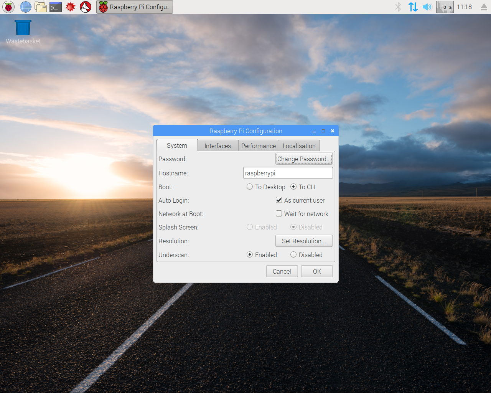

# YAST - Installation

## YAST System Requirement
    
The basic system requirements are:
- a Raspberry Pi1/2/3/4/a/b/+ 
- track signal input hardware
- a running Raspbian image (Wheezy, Jessie, Stretch, Buster, Bullseye)
- a working Internet connection (to make installing easy, can also be done without )
- wiringPi package
- libncurses5-dev package
- cp437 definitions 
- ASCII screen resolution of 80 x 36 (ideal case)

## Basic system Installation

Write a raspbian image to the SD-card.
I prefer no light versions of the raspbian distribution, so at first boot it comes up with desktop.
So boot to CLI and I2C can be easy configured.

    
The desktop can also be used to download the yast package from this page or to connect
easy an USB-Stick.
    
        
## Installation step by step by hand

The yast can be used on a local console, inside a network terminal or inside a terminal
of the X-Server. But it is codepage 437 based. So the easiest way is to
use a local, non graphical console. It makes font-switching more easier.
I use it on the standard Linux console to get the maximum display area.
As base system a fresh Raspbian on a 4GB SD Card was used.
Raspbian based on Debian Wheezy works fine, and Raspbian Jessie with PIXEL (Version: November 2016,
Release date: 2016-11-25, Kernel version: 4.4), Raspbian Stretch with Desktop is also tested (Version: September 2017,
Release date: 2017-9-08, Kernel version 4.9)
I always desktop versions, but light also may possible.
A network connection is required only for installation of the packages, later on the RaspberryPi
can be used offline. Or the Memory Card can be used in a different Pi. In this way it's easy to
use a Type A or A+. For this installation example the user "pi" is used, because it's the standard.

First the WiringPi package must be downloaded and installed.
Please check first an existing installatin by

<cite>gpio -v </cite>

On my Raspian Buster a 2.50 was already installed, an update to 2.52 as Gordons latest version works.
Please use wiringPi Version 2.36 or later, because there is a fix inside for first time ISR event usage.
For a Raspberry Pi >3 please update to Version 2.52, because of correct Pi
version handling. How to do this is shown on wiringPi website.

<cite>git clone git://git.drogon.net/wiringPi 
cd wiringPi 
./build </cite>

Newer version from https://github.com/WiringPi/WiringPi was tested with
version 2.61. 

Than the Curses package must be downloaded and installed
<cite>sudo apt-get install libncurses5-dev</cite> 
The yast uses the Code Page 437. This is the old DOS charset with it's graphic symbols.
So that's in respect to good old times, or because I become older.
The Codepage file
<cite>cp437.acm.gz</cite> from a debian distribution is used.
A copy of it is placed under
<cite>/usr/share/consoletrans</cite> 
After this you can place a copy of the download yast_XXX.tgz in your pi directory or on a USB-Stick.
Mounting a USB-Stick with respect to user pi is mounted in the following way.
Your USB-Stick can be found at /dev/sda or /dev/sda1.
<cite>sudo mount -t vfat -o uid=pi,gid=pi /dev/sda1 /media/usbstick/</cite> 
This requires, that a clean directory
<cite>/media/usbstick/</cite> exists.

Now a classic combination follows, and there it is....

<cite> mkdir yast
        cd yast
        tar -xvzf ../yastfile.tgz
        make </cite> 
	  
A script for switching on and of the screen and fontmode is included and called

<cite>./script/startyast</cite> 

## Automatic - Installation with installation script

After placing the yastfile.tgz in your local directory 

<cite> mkdir yast
        cd yast
        tar -xvzf ../yastfile.tgz
        ./script/install
        make
        </cite> 
	  
This install script tries to install wiringPi, libncurses5-dev, cp437.acm and ntpdate.

## Wheezy - Distribution specials on Raspbian Wheezy

The screen saver and screen blanking on Raspberry Pi console should be disabled.  
For this, edit the file  
<cite> /etc/kbd/config</cite> 
and change the values:
<cite>BLANK_TIME=0 
POWERDOWN_TIME=0</cite> 

The default value for both were 30 = 30 min.

Wheezy uses the ntpd.
So it should be stopped before starting yast.
This will be normally done by the startyast script.
And also started ath the end op yast.

## Jessie - Distribution specials on Raspbian Jessie

Jessie was never full scale tested from my side.
But the main program works on it.

## Scratch - Distribution specials on Raspbian Scratch
    
The screen blanking on Raspberry Pi console should be disabled.
To see the actual state of the kernel consoleblank type:
<cite>cat /sys/module/kernel/parameters/consoleblank</cite>   
consoleblank is a kernel parameter. To set it permanently, it has to be defined on the kernel command line.

For this, edit the file

<cite>/boot/cmdline.txt</cite> 

and add <cite>consoleblank=0</cite> at the end to turn screen blanking off completely.
Note the kernel command line must be a single line of text.
Scratch uses the "timedatectl" time synchronization, so the start script tries to figure out the environment.

## Screen Resolution

On the screenshots you can see a ASCII screen resolution of 80 x 36 chars.
It is realized on a monitor with a native 1280x1024 pixel resolution. In combination with
a console font of 28x16 it will fit to full screen.

Here are some Consolefonts, usable with yast. They came with Raspbian Scratch.

<cite>
CyrKoi-TerminusBold32x16 
Uni2-VGA28x16 
CyrKoi-VGA28x16 
CyrKoi-TerminusBold28x14 
CyrKoi-TerminusBold24x12 
CyrKoi-VGA16 
</cite>

## Sound activation 

To use the sound output you have to compile it in.
First the alsa sound system development files are required. Download them by:

<cite> sudo apt-get install gcc libasound2 libasound2-dev</cite> 
and set in the <cite>Makefile</cite>  
<cite> ALSA_SOUND_LIB := -lasound ALSA_SOUND := -DALSA_SOUND</cite> 
	